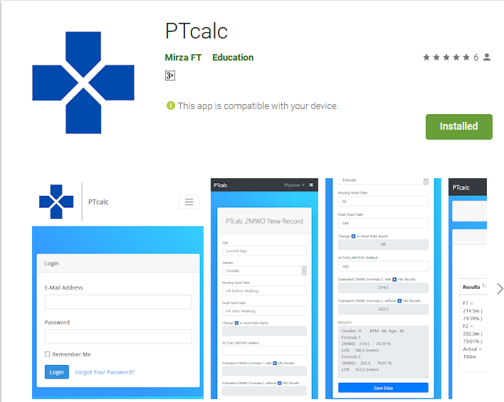
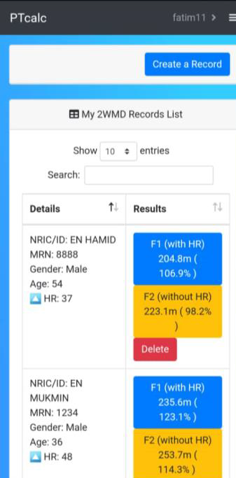
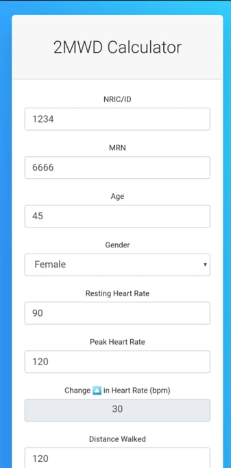
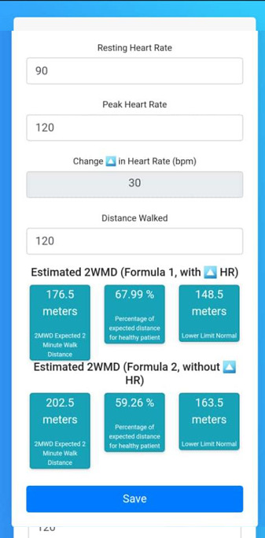

# Physiotheraphy-Calculator-System PTcalc for short.
PTcalc is a system for physiotherapists to keep track of their patients health score in various forumula integrations.  The system helps practitioners to apply the formula using a simplified system to enhance efficiency of their workflow.  PTCalc is developed using the Laravel Framework.  

Natively it is a web-based system made to be used on a browser to access.  The system applies health experts formulas using javascripts on the front-end.  While the backend will save the data for later references.  The data is saved on a databse for later use.  Some of the formula's are the famous 2-Minute-Walk-Distance and  6-Minute-Walk-Distance.  In which the Physiotherapist will be using repeatedly to all patients and multiple times for cosistency check.   

Attached is the user manual.
https://github.com/rafiqaqil/Physiotheraphy-Calculator-System/blob/master/Step%20by%20step%20guide%20to%20use%20PTcalc.pdf

PTcalc is now available on Google Playstore.
https://play.google.com/store/apps/details?id=com.mirza.app

# ScreenShots

